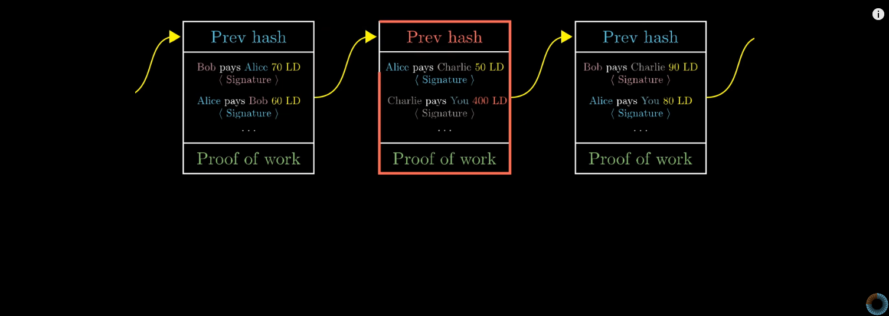

# Diving Into BlockChain

Over the past few months, I've had the pleasure of diving deep into a field I've never fully appreciated -- blockchain. The relevant programming language here is *Solidity*, a somewhat esoteric js-like language that lets us define a specific behavior for some wallet, in such a way that the behavior is public and predictable and therefore trustworthy to users.

In this post, I want to store a somewhat detailed but still general-knowledge understanding of: 

- how the blockchain and bitcoin works
- why ether is better
- why eth 2.0 will be even cooler
- spotlight on tangles and IOTA

## Bitcoin and the Blockchain

Note, my understanding behind blockchain comes mostly from (https://www.youtube.com/watch?v=bBC-nXj3Ng4)[this 3Blue1Brown video on youtube]. The author there focuses on providing some pretty intuitive visuals while still hinting at the math involved. Here, I'm focusing on the stuff that interested me from the video, without actually consulting it. Going by memory here.

In my understanding, Blockchain is a way of making a **public** database **immutable**, meaning un-changeable. Imagine we have a lot of data that needs to be shared -- in the case of Bitcoin, this is a user transaction history that everybody has verified to be real -- and we need a way of making sure that not everybody needs to store it, but that a malicious actor can't change any numbers in the parts they store.

Blockchain divides this data into sections (blocks), that it then strings together into a line (chain). This allows the thousands of people participating in the blockchain to each grab a couple blocks to store -- ideally, there would be a ton of overlap such that if one's person computer was unavailable, somebody else would be able to provide data. However, before being stored, each block also receives the **hash** of the preceding block on the chain. A hash is a unique, usually somewhat short, data tag that gets produced from the actual contents of the block, in such a way that they loook very random, but if you pass in the same data you'll get the same hash, every time. This hash attaches the current block to the previous block on the chain.

The video has a very pretty, and imho intuitive visualization for this: 

Hypothetically, this is it. Blockchain itself doesn't really do anything more, and there's nothing that intrinsically protects against somebody creating a *new* block with fake data, or fake transactions, on a raw blockchain. In practice, each transaction is signed by the auther with the timestamp, such that it can never be reproduced by anyone again. Bitcoin however has another safeguard -- transactions are validated using a step called **proof of work**. When you want to add a transaction into the blockchain database, you send it out to miners who then collect all these transactions (and the previous block hash) into a new block. At that point, any of them might be the ones to 'mine' the new block and get the reward for doing that. In practice -- they try to add a new dummy number into the block, such that the hash begins with a lot of zeros. Whoever reaches a specific amount of zeroes first gets to publish the block and gain the mining reward. This means that there are a lot of eyes on the next block, and only a valid block will be accepted.

## Ethereum

Ethereum currently works the same way -- transactions are gathered into blocks, validated by trying random numbers until the proper hash is found, and appended to the chain. However, while Bitcoin only serves as a read/write database, keeping track of account balances and nothing else, Ethereum allows for users to add a much broader range of things to blocks. Among these: executable code, in the form of something called a *Smart Contract*.

The most differentiating feature of Ethereum is that users are allowed to create automated, robotic accounts, ie Smart Contracts, with a pre-determined and unchangeable behavior that is simultaneously very visible to everybody (because its stored on the blockchain). This inherent trust makes contracts perfect for a variety of financial applications. It's easy to send money to such an automated account if you know exactly what you have to do to get it back, potentially with interest, potentially at a more convenient time. There is an estimated ~7 billion of assets currently being held by smart contracts.

Of course, since we're dealing with programming, there's also a new programming language to go along with this: *Solidity*. Solidity lets us define contracts and behaviors, to later deploy by publishing them onto the ethereum chain permanently -- no edits or updates allowed -- using other tools like *Truffle*. This language resembles JS in lots of ways, and lots of the tooling like Truffle is built in JS as well, so you'll need to be familiar with that language before trying to do anything.

There are a couple cool patterns or common applications that people have built that I also want to review. For example, Smart Contracts have been used to implement completely new digital currencies, using the ERC20 pattern, that are then tradeable on common crypto exchanges. Freelance developers could deploy fan tokens for soccer teams, or build so-called *stable coins* that track the price of the dollar, or even impose other behavior to let owners arbitrage the very mining operations Ether is built on.  More recently, people have implemented a new type of token called an NFT (Non-Fungible Token), using the ERC721 pattern, which is a digital currency in which each token is somehow unique from all the others. These have been recently getting used for art auctions, which have usually also happened on the chain. Lots of people have been trying to implement various voting sysems, and a pattern of DAO's (Decentralized Autonomous Organizations) has been emerging which allows investors to pool money into a single wallet and collectively vote on investments or general decisions. This space is incredibly new, lots of the cool ideas are only a couple years old, the FTC is still racing to classify these new asset types, and participants frequently describe the hype as "similar to when the beginning of the internet was happening". Nevertheless, the short history still has it's fair share of stories. Some readers may be aware of the split between Ethereum and Ethereum Classic -- these are in fact two different blockchains. They were split apart when, on the original Ethereum Classic chain, a large amount of money was siphoned from probably *the original* DAO due to poorly-written smart contract code -- the owners and the miners of Ethereum chain decided instead to revert the chain to before the attack, thereby **forking** the Ethereum chain into the Ethereum we know today, and an old Ethereum Classic that some users have continued using.

## Ethereum 2.0

However, it's time to introduce one of the bad guys of Ethereum development: gas prices. Gas is the reward, usually denominated in tiny amounts of ether, that miners get for putting *youuur* data on the blockchain before anybody else's. It's like the tip to the waiter at a restaurant, if waiters only got paid in tips and were really passive aggressive about it. If you try to make a change to the blockchain and do not add gas, or add too little gas, miners will simply not pick it up and it will never be added. If you add a lot of gas -- you can expect to be serviced right away.

If one looks at gas prices over the past several months (writing in early Jul, 2021), we can see that gas prices have been high. Very high. In fact, to add a single ethereum transaction to the blockchain might cost a user as much as 50 cents to a dollar. High gas prices make the system much less usable. They are, in fact, symptoms of poor architecture, that the newly created and soon-to-be-merge fork of Ethereum, Eth 2.0, will fix (don't ask me how, but they'll be combined and won't be two separate blockchains eventually).

The most important of these, in my mind, is actually the linearity of the system inherent in blockchain. If one were to compare a service like PayPal to Ethereum, where both hypothetically handle transactions, one can see that Ethereum is very limited in the amount of transactions per second it can achieve. This is because every single transaction needs to be added and verified **linearly**, ie, even if 2000 people are trying to trade, we need to take them one at a time, add them to the block, hash the block once its full, and continue along. Paypal, on the other hand, can just start another server and open another connection to a bank to handle extra volume. In lots of ways, this issue plagues Bitcoin as well, and Bitcoin is worse off because it can't be patched like Ethereum is about to be. It's transactions per second are permanently limited.

Ethereum however, will soon get around this by breaking the single chain into **shards**, such that different regions will verify separate transactions, and won't have every single miner verifying every single transaction. Hypothetically, this will allow Ethereum to scale just like PayPal does -- when there's more volume, it'll open a new shard to handle it, and that shard will be 'merged' back into the chain eventually.

Another big change that's coming will actually throw out the way transactions are currently being verified. Recall, Ethereum is operating on a **proof of work** validation method, in which computers run to find the right hash before commiting a block. This new method is instead called **proof of stake** -- instead of solving math problems, users will instead have to put up some of their existing ethereum to vouch for a specific block. If that block is found to be fake, the ethereum is destroyed and the user looses priveleges that allow them to participate in proofs. However, if nobody challenges the block, after some amount of time, the block is added permanently and the sum is returned with a small amount of bonus ethereum.

Disclaimer, I am not familiar with either of these systems. I'm just trying to be a developer, I don't know how it works on the inside. But, this method has been widely praised as, firstly, **much easier** for people to do than guess hashes, and also **much cheaper** electricity wise, which should help with the whole environmental-issue image blockchain has gotten for itself.

Ideally, Eth 2.0 will enable a much better, cleaner, faster Ethereum, and lead to a significant drop in Gas prices so I can use the thing again. Because rn, I've been told it costs literally thousands of dollars to deploy contracts.

## Tangles and IOTA

There are of course contenders. IOTA is a new crypto / blockchain company that is actually not creating a blockchain in the traditional sense -- it's creating something called a **tangle**. It behaves in almost the same way: one can make transactions of the IOTA coin (name might vary, typing on a plane), deploy any data, view things on the chain, etc. However, there are a couple unique things that come with this architecture that, in proportion, Ethereum is doing a lot of fancy legwork to approximate and therefore might trip up somewhere.

A tangle is distinct from a blockchain in that it doesn't attempt to be linear. For example, a single block on a blockchain may only have a single 'parent' or origin block, and may only have a single 'child' or successor block. It's a chain, strung in a single-file line, and new blocks get added to the back. A block in a tangle, however, is allowed to have more than one parent, and more than one child attached to itself. In this way they form a net, usually a couple blocks wide, where all the blocks within them are connected to exactly 2 blocks before themselves and usually have 2 or 3 children following. Remember that these connections are just the way of storing a reference to the previous block and storing its hash. This unique architecture allows for multiple blocks to be in the process of creation on the tangle at any given time. In fact, if there's a lot of demand, users will automatically make this net wider, making the previous layer have 4 children instead of 2, thus widening how big the tangle is.

Furthermore, IOTA also has no concept of mining blocks. In fact, if you want to make a transaction on their tangle, you basically have to mine it yourself -- you can create your block, and then you need to validate two already-existing blocks before attaching your new block to those. Thus, the users of the tangle and the miners of the tangle are the same. Practically speaking, this means we have zero gas fees, we just need to do a little bit more work adding new blocks.

On the surface level, it seems like this is everything that Ethereum could ever hope to be and more. I'm really excited to see the project, which is currently in active development, begin to support smart contracts and open themselves up to more use cases. It just seems that Eth 2.0, while a great step forward, is trying and failing to achieve something in a very complicated way, that IOTA has perfected from the beginning due to its architecture. It'll be interesting to see how these projects develop over time, and to see which deploys first (IOTA contracts or Eth 2.0).
